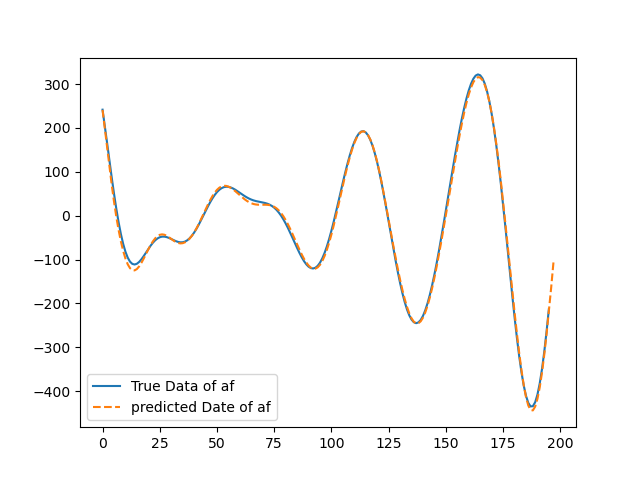

# Ship data LSTM Model

An attempt to build a highly versatile LSTM model. By adjusting the parameters in the source code, this model can be used for LSTM prediction across various types of data, making "experimentation" (refinement) simple. LSTM, with its introduction of memory cells and gate mechanisms, addresses the long-term dependency problem of RNNs. Since its inception, it has been widely applied in fields such as natural language processing and time series prediction.

## How to Use

I chose to use [uv](https://docs.astral.sh/uv/getting-started/installation/) for managing my Python environment, If you want to train the model, you can run the following code.

```python
uv sync
uv run main.py --train True
```

If you want to make predictions on your own data, simply modify the corresponding parameters in the `cfgs.yaml` file.

- `input_size`: Represents the dimension of the input data or the number of features. In this model, it refers to two dimensions, $af$ and $am$. For text data, it represents the word embedding size. At the same time, `input_size = len(inputs_cols)`.
- `output_size`: Represents the dimension of the output data. Similar to input_size, in this model, it can be set to 1 or 2. The corresponding label_cols can be [0], [1], or [0, 1]. Similarly, `output_size = len(label_cols)`.
- `seq_len`: Represents the sequence length. Simply put, it can be understood as using the previous `seq_len` data points of dimension `input_size` to predict the subsequent `predict_data` points of dimension `output_size`.

## our results

The data used in this model is simulated data representing the forces and moments acting on a ship over time. The relationship between the predicted values and the true values is shown in the plots below.



## Update

Using pytorch to implement Transformer from scratch for "English-French" dataset machine translation,The model is built based on [DIVE INTO DEEP LEARNING](https://github.com/d2l-ai/d2l-zh)
