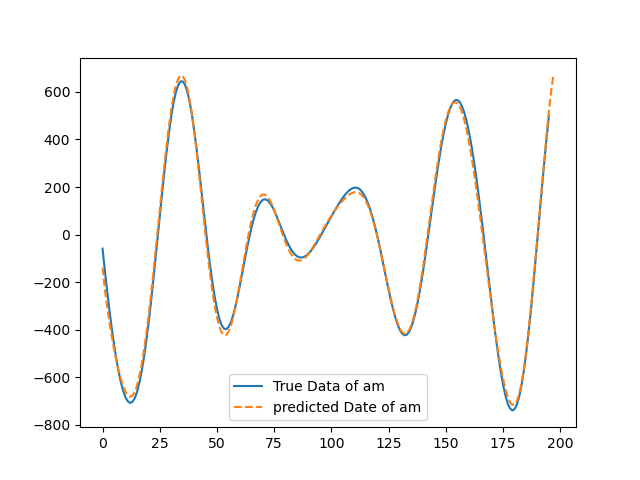

# a-general-LSTM-model

尝试构建了一种普适性较高的LSTM模型，可以通过调整源码中的参数对各类数据进行LSTM预测，轻松实现炼丹。LSTM通过引入记忆单元和门机制，解决了RNN的长期依赖问题，自提出以来被广泛应用于自然语言处理、时间序列预测等领域。

## how to use

如果你想要训练模型

```python
python main.py --train True
```

如果你想要对自己的数据进行预测仅仅需要更改`cfgs.yaml`文件中相应的参数。

- `input_size`表示输入数据的维度，特征数量， 该模型数据中表示$af$和$am$ 2个维度，若在文本中则表示词向量，同时`input_size=len(inputs_cols)`
- `output_size`表示输出数据维度，与`input_size`类似，在本模型中可以选择1或2,对应的`label_cols`为[0], [1],或[0, 1]，同样`output_size=len(label_cols)`
- `seq_len`表示序列长度，简单来说可以理解成用前`seq_len`个`input_size`维度的数据预测后`predict_data`个`output_size`维度的数据。

## our results

本模型使用的数据为仿真得到的船舶受到的力和力矩随时间变化的数据，得到的预测和真实值之间的关系如下图中所示。



